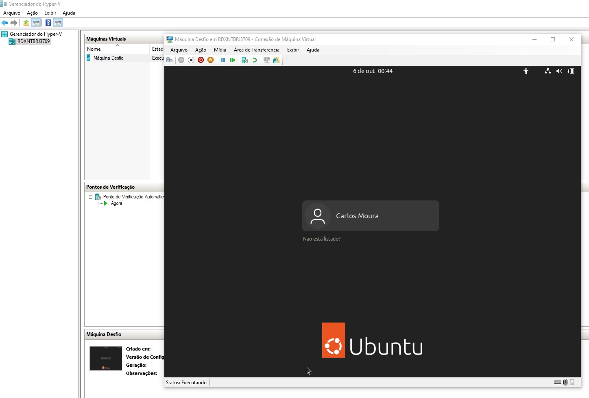
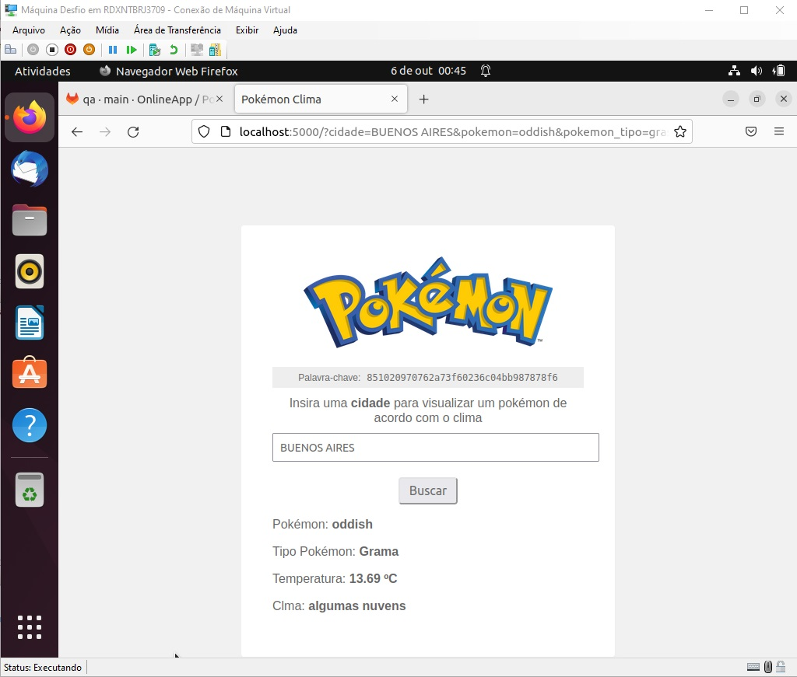

<h1> Desafio OnlineApp </b> </h1>

## <b> ``Introdução`` </b>

**Antes de iniciar o desafio de fato, fiz a leitura de todo o desafio mais de uma vez e montei um plano para facilitar o processo. Escrevi as condições relacionadas a temperatura em um arquivo a parte e depois gerei fórmulas no excel. Fazendo isso, tornou-se bem mais simples de realizar uma quantidade enorme de buscas, sendo necessário apenas o preenchimento dos campos no excel.**

 

## <b> ``Estrutura``</b>

**Aqui vou explicar um pouco da estrutura apresentada para facilitar o entendimento por parte de vocês.**

**Pasta documentos:** 

    Dentro da pasta documentos, há um arquivo excel que contém os 100 resultados realizados durante os testes.

**Pasta Casos de Teste:** 

    Um arquivo contendo os casos de testes bem descritos para os desenvolvedores validarem o processo.

**Pasta Bugs:** 

    Um arquivo contendo os bugs encontrados e reportados da melhor maneira possível para um melhor entendimento do desenvolvedor.

**Pasta Imagens:** 

    Apenas adicionei as imagens que serão apresentados neste documento.

 

## <b> ``Pasta Documentos``</b>

**O arquivo excel contém 9 colunas:**

- Qtd: Mostra a quantidade de linhas
- Cidade: Quais cidades foram utilizadas na busca
- Nome Pokemon: O nome do pokemon apresentado após a busca
- Tipo Busca: O tipo do pokemon apresentado após a busca
- Temperatura: A temperatura apresentada após a busca
- Chovendo: Se estava chovendo ou não
- Tipo Correto: Para essa coluna foi criado uma fórmula onde é feito um comparativo entre a temperatura proposta no desafio e o tipo apresentado na busca, além de considerar o Pokemon elétrico no caso de chuva.
- Repetido: Uma das exigências do desafio, era de reportar um erro sempre que o pokemon repetisse na busca
- Avaliação: Um resultado com apenas dois resultados: "Tipo Igual" e "Tipo Diferente". Levando em conta as colunas "Tipo Busca", "Tipo Correto" e "Chovendo".

 

    Criei no excel, algo que pudesse me auxiliar de uma maneira prática diminuindo o trabalho cansativo em comparar o tipo do pokemon, a temperatura e se está chovendo. Algo parecido com "Automatização" de software. Fazendo isso, pude realizar 100 testes de maneira prática, rápida e assertiva!

 

**Consegui os seguintes resultados:**

**Relatório Geral**

Dado   | Valor
--------- | ------
Total Cidades | 100
Total Tipos Encontrados | 8
Média Temperatura | 22,3
Cidades Chovendo | 2
Cidades Cidades Sem Chuva | 98
Buscas Repetidas | 24
Pokemons Iguais | 86
Pokemons Diferentes | 14
Total Pokemons Encontrados | 6

 

**Apresentados pela busca**

Dado   | Valor
--------- | ------
Pokemons Terra | 33
Pokemons Inseto | 24
Pokemons Pedra | 22
Pokemons Grama | 10
Pokemons Fogo | 6
Pokemons Água | 5
Pokemons Elétrico | 0
Pokemons Normal | 0

 

**De acordo com a temperatura**

Dado   | Valor
--------- | ------
Pokemons Terra | 33
Pokemons Pedra | 22
Pokemons Inseto | 17
Pokemons Grama | 8
Pokemons Normal | 7
Pokemons Fogo | 6
Pokemons Água | 5
Pokemons Elétrico | 2

 

**Pokemons mais encontrados**

Dado   | Valor
--------- | ------
Nidoking | 33
Weedle | 24
Onix | 22
Oddish | 10
Vulpix | 6
Psyduck | 5

 

## <b> ``Acessando os Casos de testes``</b>

**Para acessar o arquivo, clique no link abaixo:**

https://github.com/moura1995/desafio-onlineapp/blob/main/Casos%20de%20teste/Casos%20de%20Testes.md

 

## <b> ``Acessando os Bugs``</b>

**Para acessar o arquivo, clique no link abaixo:**

https://github.com/moura1995/desafio-onlineapp/blob/main/bugs/Bugs.md

 

## <b> ``Acessando a aplicação``</b>

**Como foi proposto no desafio, um ponto extra seria fornecido ao candidato que rodasse localmente o teste em um servidor local. Criei uma máquina linux usando o Hyper-V nativo do Windows, como mostra a imagem abaixo.**

 

**Abaixo segue a Palavra-chave fornecida ao rodar localmente.** 

    851020970762a73f60236c04bb987878f6
